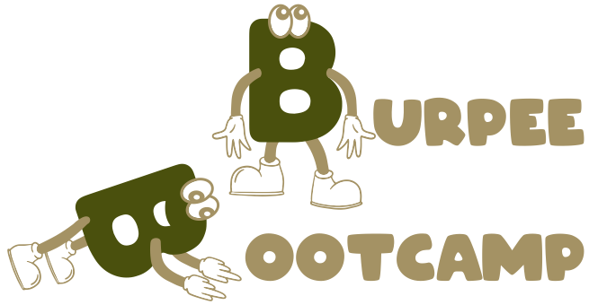

# BurpeeBootcamp 💪

> Get stronger every day, one burpee at a time!

Live demo: https://burpee-bootcamp.lamdera.app

## About

BurpeeBootcamp is a progressive web app that helps you track and improve your burpee workouts. Simply place your phone on the floor and touch the screen with your nose at the bottom of each rep to count your burpees!

## Features

For a complete list of features, please visit [burpeepootcamp.club](https://burpeepootcamp.club)

## Installation

### Install as PWA (Recommended)

#### iPhone (iOS)

1. Open BurpeeBootcamp in Safari
2. Tap the share button ⬆️ at the bottom of the screen
3. Scroll down and tap "Add to Home Screen"
4. Tap "Add" in the top right

#### Android

1. Open BurpeeBootcamp in Chrome
2. Tap the menu (three dots)
3. Tap "Add to Home Screen"
4. Follow the prompts to install

## Development

### Prerequisites

- [Node.js](https://nodejs.org/) (latest LTS version)
- [Elm](https://elm-lang.org/) (0.19.1)
- [Lamdera](https://lamdera.com/)
- [Elm Land](https://elm.land) (v0.20.1)

### Local Setup

1. Clone the repository:

   - git clone https://github.com/yourusername/burpee-bootcamp.git
   - cd burpee-bootcamp

2. Install dependencies:

   - npm install

3. Start the development servers:

   - In one terminal: npm run watch:css
   - In another terminal: elm-land server
   - In a third terminal: lamdera live

4. Open http://localhost:8000 in your browser

### Building for Production

1. Build CSS: npm run build:css
2. Build Elm Land: npx elm-land build
3. Add generated files
4. Check and deploy with Lamdera:
   - lamdera check
   - lamdera deploy

## License

MIT

## Contributing

Contributions are welcome! Please feel free to submit a Pull Request or open an Issue.
